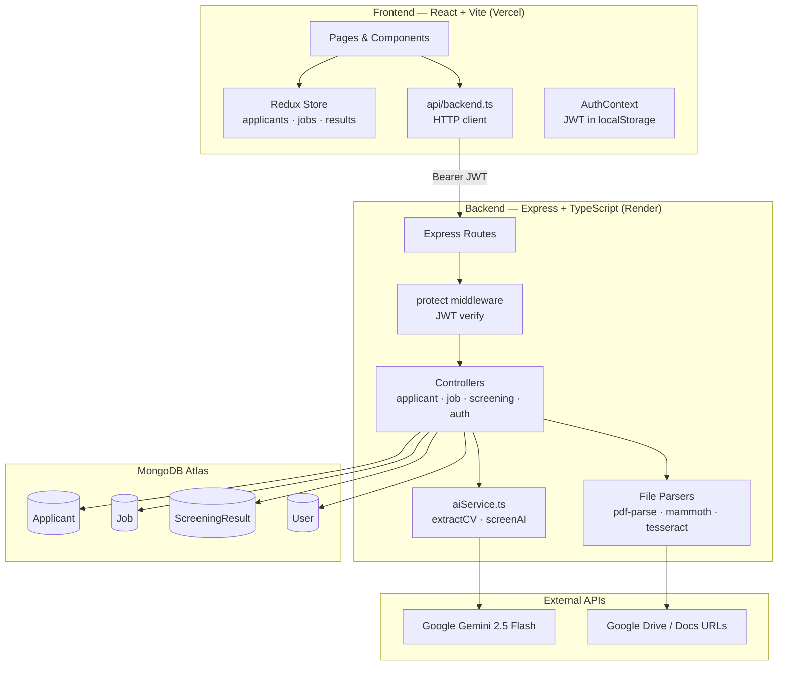

# TalentScreen — AI-Powered HR Screening Platform

> An internal HR tool that uses Google Gemini to parse resumes, screen candidates, and rank applicants for job openings.

---

## Live Demo

| | |
|---|---|
| **Frontend** | https://umurava-hackthon-april.vercel.app |
| **Backend**  | https://umurava-hackthon-april-snid.onrender.com |

### Judge Login Credentials

Two isolated accounts are pre-loaded — each judge gets their own sandbox with no data crossover.

| Account | Email | Password |
|---|---|---|
| Judge 1 | `judge1@talentscreen.demo` | `Judge#Demo1` |
| Judge 2 | `judge2@talentscreen.demo` | `Judge#Demo2` |

> Each account is fully isolated — jobs, candidates, and screening results created by one judge are not visible to the other.

---

## Architecture Diagram



---

## Setup Instructions

### Prerequisites

- Node.js ≥ 18
- npm ≥ 9
- A MongoDB Atlas account (or local MongoDB)
- A Google Gemini API key

---

### Local Development

#### 1. Clone the repo and install dependencies

```bash
# Backend
cd backend
npm install

# Frontend
cd ../frontend
npm install
```

#### 2. Configure environment variables

Create `.env` in the **backend** directory:

```env
PORT=3000
MONGODB_URI=mongodb+srv://<user>:<password>@cluster.mongodb.net/talentscreen
JWT_SECRET=your_super_secret_key_here
GEMINI_API_KEY=your_gemini_api_key_here
CLIENT_ORIGIN=http://localhost:5173
```

Create `.env` in the **frontend** directory:

```env
VITE_API_BASE_URL=http://localhost:3000/api
```

#### 3. Seed the database (first-time only)

```bash
cd backend
npx ts-node scripts/seedUsers.ts
```

This creates all team accounts and the two judge demo accounts.

#### 4. Run the development servers

```bash
# Backend (runs on port 3000)
cd backend
npm run dev

# Frontend (runs on port 5173)
cd frontend
npm run dev
```

Open `http://localhost:5173` in your browser.

---

### Production Deployment

#### Backend → Render

1. Push your backend code to a GitHub repository.
2. Create a new Web Service on [Render](https://render.com) and connect the repo.
3. Set the following environment variables in the Render dashboard:

```
PORT=3000
MONGODB_URI=<your Atlas connection string>
JWT_SECRET=<strong random string>
GEMINI_API_KEY=<your Gemini key>
CLIENT_ORIGIN=https://your-frontend.vercel.app
```

4. Set **Build Command** to `npm install && npm run build` and **Start Command** to `npm start`.

#### Frontend → Vercel

1. Push your frontend code to GitHub.
2. Import the project on [Vercel](https://vercel.com).
3. Set the environment variable in Vercel project settings:

```
VITE_API_BASE_URL=https://your-backend.onrender.com/api
```

4. Vercel auto-detects Vite. Build command is `npm run build`, output directory is `dist`.

#### Post-deployment checklist

- [ ] Run `npx ts-node scripts/seedUsers.ts` against the production DB to create judge accounts
- [ ] Test login with judge credentials
- [ ] Create a job
- [ ] Upload a PDF resume and verify it parses correctly
- [ ] Run AI screening on the job
- [ ] Verify the compare page loads
- [ ] Check CORS: backend `CLIENT_ORIGIN` must exactly match the Vercel URL

---

## Environment Variables

### Backend

| Variable | Required | Description |
|---|---|---|
| `PORT` | No | Server port (default: `3000`) |
| `MONGODB_URI` | **Yes** | Full MongoDB Atlas connection string |
| `JWT_SECRET` | **Yes** | Secret key for signing JWTs — keep this strong and private |
| `GEMINI_API_KEY` | **Yes** | Google Gemini API key from [Google AI Studio](https://aistudio.google.com) |
| `CLIENT_ORIGIN` | **Yes** | Frontend URL for CORS (e.g. `https://yourapp.vercel.app`) |

### Frontend

| Variable | Required | Description |
|---|---|---|
| `VITE_API_BASE_URL` | **Yes** | Full backend API base URL including `/api` |

> ⚠️ Never commit `.env` files. Add them to `.gitignore`.

---

## AI Decision Flow Explanation

### 1. CV / Resume Extraction

When a candidate's resume is uploaded (PDF, DOCX, image, or URL), the backend extracts raw text and sends it to Gemini with a strict data-extraction prompt. The prompt instructs Gemini to:

- Return **only valid JSON** — no markdown, no preamble
- Map resume content to a fixed schema (name, email, skills, experience, education, etc.)
- Return `null` for fields it cannot find — never guess
- Infer skill levels from contextual clues (years of experience, seniority language)
- Return `{ error: "not_a_resume" }` if the text is not a CV

The response is stripped of any markdown fences, then `JSON.parse()`d. If parsing fails or the error flag is set, the upload is rejected with a descriptive error.

### 2. Candidate Screening

When the HR user clicks "Run AI Screening" on a job, the backend:

1. Fetches the job document (title, description, required/preferred skills, experience level)
2. Fetches all candidates linked to that job
3. Sends both to Gemini with a scoring prompt that includes the user-configured **weights** (skills, experience, education, relevance — must sum to 100%)

Gemini returns a ranked list of candidates with:
- A `match_score` (0–100) — the weighted composite
- Four sub-scores (skills, experience, education, relevance)
- `confidence_level` (High/Medium/Low) based on data completeness
- `recommendation` (Strong Yes / Yes / Maybe / No)
- `strengths[]` — reasons the candidate is a good fit
- `gaps[]` — missing qualifications (with dealbreaker vs nice-to-have classification)
- `bias_flags[]` — any detected potential bias indicators

The previous screening results for that job are **deleted** before the new results are inserted, ensuring results always reflect the current candidate pool.

---

## Assumptions and Limitations

### Assumptions

- **Single-tenant:** Each user account is siloed — they can only see jobs and candidates they created. There is no team/organisation layer.
- **English-language resumes:** The Gemini prompt and OCR pipeline are optimised for English.
- **Gemini availability:** AI features depend on Google Gemini being reachable. If the API is down, uploads and screenings will fail gracefully with an error message.
- **Google Drive links are public:** The URL-based CV upload requires files shared as "Anyone with the link."

### Limitations

- **No self-registration:** Accounts are created by seeding. This is intentional for an internal HR tool — an admin provisions accounts.
- **No resume deduplication:** The same candidate uploaded twice creates two records.
- **No token refresh:** An expired token requires the user to log out and back in.
- **File size limit:** Express body parser is limited to 10MB.
- **No pagination:** All candidates and results are returned in a single API call.

---

## Prompt Engineering Notes

### CV Extraction Prompt Design

- **Role framing:** "You are a precise ATS data extraction engine"
- **Negative rules first:** Explicitly tells the model what NOT to do before positive rules
- **Explicit null handling:** "If a field cannot be found, return null — never guess"
- **JSON-only output:** Response cleaning strips any stray backtick fences before parsing
- **Not-a-resume escape hatch:** Returns `{ "error": "not_a_resume" }` for non-resume content

### Screening Prompt Design

- **Unbiased recruiter framing:** "You are an expert, unbiased AI recruiter"
- **Weights as percentages in prompt:** User-configured weights injected directly into prompt text
- **Hard scoring rule:** "A candidate missing more than 2 required skills must score below 50 overall"
- **Bias flag instruction:** Model flags potential bias indicators surfaced to the HR user
- **Top-N control:** `shortlistSize` injected into the prompt so Gemini returns only the requested number
