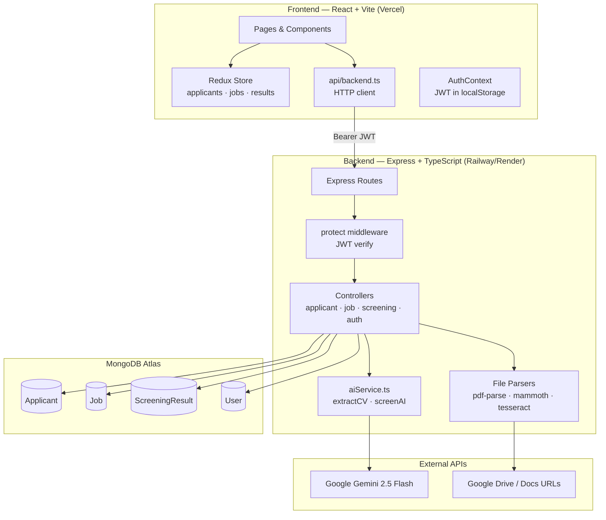

# TalentScreen — AI-Powered HR Screening Platform

> An internal HR tool that uses Google Gemini to parse resumes, screen candidates, and rank applicants for job openings.

---

## Architecture Diagram



> **File:** An architecture diagram in Mermaid format is embedded above. Paste it into [mermaid.live](https://mermaid.live) to render it visually.

---

## Setup Instructions

### Prerequisites

- Node.js ≥ 18
- npm ≥ 9
- A MongoDB Atlas account (or local MongoDB)
- A Google Gemini API key

---

### Local Development

#### 1. Clone the repo and install dependencies

```bash
# Backend
cd backend
npm install

# Frontend
cd ../frontend
npm install
```

#### 2. Configure environment variables

Create `.env` in the **backend** directory:

```env
PORT=3000
MONGODB_URI=mongodb+srv://<user>:<password>@cluster.mongodb.net/talentscreen
JWT_SECRET=your_super_secret_key_here
GEMINI_API_KEY=your_gemini_api_key_here
CLIENT_ORIGIN=http://localhost:5173
```

Create `.env` in the **frontend** directory:

```env
VITE_API_BASE_URL=http://localhost:3000/api
```

#### 3. Seed the database (first-time only)

```bash
cd backend
npx ts-node scripts/seedUsers.ts
```

This creates the default HR user account.

#### 4. Run the development servers

```bash
# Backend (runs on port 3000)
cd backend
npm run dev

# Frontend (runs on port 5173)
cd frontend
npm run dev
```

Open `http://localhost:5173` in your browser.

---

### Production Deployment

#### Backend → Railway (or Render)

1. Push your backend code to a GitHub repository.
2. Create a new project on [Railway](https://railway.app) and connect the repo.
3. Set the following environment variables in the Railway dashboard:

```
PORT=3000
MONGODB_URI=<your Atlas connection string>
JWT_SECRET=<strong random string>
GEMINI_API_KEY=<your Gemini key>
CLIENT_ORIGIN=https://your-frontend.vercel.app
```

4. Railway will auto-detect Node.js and run `npm start`. Make sure your `package.json` has:
```json
"scripts": {
  "start": "node dist/src/server.js",
  "build": "tsc"
}
```
5. Railway will give you a public URL like `https://backend-production-xxxx.up.railway.app`.

#### Frontend → Vercel

1. Push your frontend code to GitHub.
2. Import the project on [Vercel](https://vercel.com).
3. Set the following environment variable in the Vercel project settings:

```
VITE_API_BASE_URL=https://your-backend.up.railway.app/api
```

4. Vercel auto-detects Vite. The build command is `npm run build`, output directory is `dist`.
5. Every `git push` to `main` will trigger a new deployment automatically — this is how you push bug fixes for your team to review on the fly.

#### Post-deployment checklist

- [ ] Test login with seeded credentials
- [ ] Create a job
- [ ] Upload a PDF resume and verify it parses correctly
- [ ] Run AI screening on the job
- [ ] Verify the compare page loads
- [ ] Check CORS: backend `CLIENT_ORIGIN` must exactly match the Vercel URL

---

## Environment Variables

### Backend

| Variable | Required | Description |
|---|---|---|
| `PORT` | No | Server port (default: `3000`) |
| `MONGODB_URI` | **Yes** | Full MongoDB Atlas connection string |
| `JWT_SECRET` | **Yes** | Secret key for signing JWTs — keep this strong and private |
| `GEMINI_API_KEY` | **Yes** | Google Gemini API key from [Google AI Studio](https://aistudio.google.com) |
| `CLIENT_ORIGIN` | **Yes** | Frontend URL for CORS (e.g. `https://yourapp.vercel.app`) |

### Frontend

| Variable | Required | Description |
|---|---|---|
| `VITE_API_BASE_URL` | **Yes** | Full backend API base URL including `/api` (e.g. `https://your-backend.up.railway.app/api`) |

> ⚠️ Never commit `.env` files. Add them to `.gitignore`.

---

## AI Decision Flow Explanation

### 1. CV / Resume Extraction

When a candidate's resume is uploaded (PDF, DOCX, image, or URL), the backend extracts raw text and sends it to Gemini with a strict data-extraction prompt. The prompt instructs Gemini to:

- Return **only valid JSON** — no markdown, no preamble
- Map resume content to a fixed schema (name, email, skills, experience, education, etc.)
- Return `null` for fields it cannot find — never guess
- Infer skill levels from contextual clues (years of experience, seniority language)
- Return `{ error: "not_a_resume" }` if the text is not a CV

The response is stripped of any markdown fences, then `JSON.parse()`d. If parsing fails or the error flag is set, the upload is rejected with a descriptive error.

### 2. Candidate Screening

When the HR user clicks "Run AI Screening" on a job, the backend:

1. Fetches the job document (title, description, required/preferred skills, experience level)
2. Fetches all candidates linked to that job
3. Sends both to Gemini with a scoring prompt that includes the user-configured **weights** (skills, experience, education, relevance — must sum to 100%)

Gemini returns a ranked list of candidates with:
- A `match_score` (0–100) — the weighted composite
- Four sub-scores (skills, experience, education, relevance)
- `confidence_level` (High/Medium/Low) based on data completeness
- `recommendation` (Strong Yes / Yes / Maybe / No)
- `strengths[]` — reasons the candidate is a good fit
- `gaps[]` — missing qualifications (with dealbreaker vs nice-to-have classification)
- `bias_flags[]` — any detected potential bias indicators (name, graduation year, institution prestige)

The previous screening results for that job are **deleted** before the new results are inserted. This ensures results always reflect the current candidate pool.

### 3. AI Job Recommendations (Planned Feature)

A planned feature will match candidates against other open jobs in the database if they score ≥ 70% match. This is not yet fully implemented.

---

## Assumptions and Limitations

### Assumptions

- **Single-tenant:** Each user account is siloed — they can only see jobs and candidates they created. There is no team/organisation layer.
- **English-language resumes:** The Gemini prompt and OCR pipeline are optimised for English. Non-English resumes may extract with reduced accuracy.
- **Gemini availability:** The AI features depend entirely on Google Gemini being reachable. If the API is down or returns 503, uploads and screenings will fail gracefully with an error message.
- **Google Drive links are public:** The URL-based CV upload resolves Google Drive share links, but the file must be shared as "Anyone with the link" — private files cannot be accessed.
- **Honest AI scores:** Gemini is instructed to score honestly and not pad scores. Candidates with mostly empty data will receive low scores and a "Low" confidence level.

### Limitations

- **No resume deduplication:** If the same candidate's resume is uploaded twice, they will be created as two separate records. A duplicate check (by email + jobId) needs to be added.
- **No token refresh:** JWTs are issued without expiry rotation. An expired token requires the user to log out and log back in.
- **File size limit:** The Express body parser is limited to 10MB. Large image files (for OCR) may be rejected.
- **CSV parsing is naive:** The CSV parser splits by comma, which breaks for values that contain commas (e.g. a skill like "Python, R"). A proper CSV library (e.g. `papaparse`) should be used for robust parsing.
- **`sourceType` enum gap:** The Applicant model enum for `sourceType` includes `manual`, `pdf`, `csv`, `json` but not `docx` or `image_ocr`. Mongoose will silently reject those values. This needs to be fixed in the schema.
- **No pagination:** All candidates and results are returned in a single API call. This will degrade with large datasets.
- **Gemini context window:** Very long resumes (>10,000 words) may be truncated or cause higher latency.

---

## Prompt Engineering Notes

### CV Extraction Prompt Design

The CV extraction prompt uses several techniques to produce reliable, structured output:

- **Role framing:** Opens with "You are a precise ATS data extraction engine" to set context and constrain behaviour.
- **Negative rules first:** Explicitly tells the model what NOT to do (guess, hallucinate, include commentary) before the positive rules.
- **Explicit null handling:** "If a field cannot be found, return null — never guess." This prevents the model from filling in plausible-sounding but wrong data.
- **Array defaults:** "Return an empty array `[]` if nothing is found. Do NOT return a placeholder object inside the array." — prevents fake entries in skill/experience lists.
- **Canonical enum values:** Skill levels and education levels are given as explicit allowed values so the model doesn't invent its own.
- **JSON-only output:** The prompt ends with "Return ONLY valid JSON. No markdown fences, no explanation, no preamble." Response cleaning strips any stray backtick fences before parsing.
- **Not-a-resume escape hatch:** Instructs the model to return `{ "error": "not_a_resume" }` for non-resume content, which the backend detects and returns a 422 to the user.

### Screening Prompt Design

- **Unbiased recruiter framing:** "You are an expert, unbiased AI recruiter" — primes the model to score on merit.
- **Weights as percentages in prompt:** The user-configured weights are injected directly into the prompt text so the model's scoring logic reflects them.
- **Hard scoring rule:** "A candidate missing more than 2 required skills must score below 50 overall" — prevents padding of weak candidates.
- **Structured recommendation enum:** `recommendation` must be exactly one of four values — prevents free-text that would break frontend rendering.
- **Bias flag instruction:** The model is asked to flag potential bias indicators (name origin, institution prestige, graduation year implying age) — these are surfaced to the HR user for awareness.
- **Top-N control:** `shortlistSize` is injected into the prompt so Gemini only returns the requested number of candidates rather than all of them.
